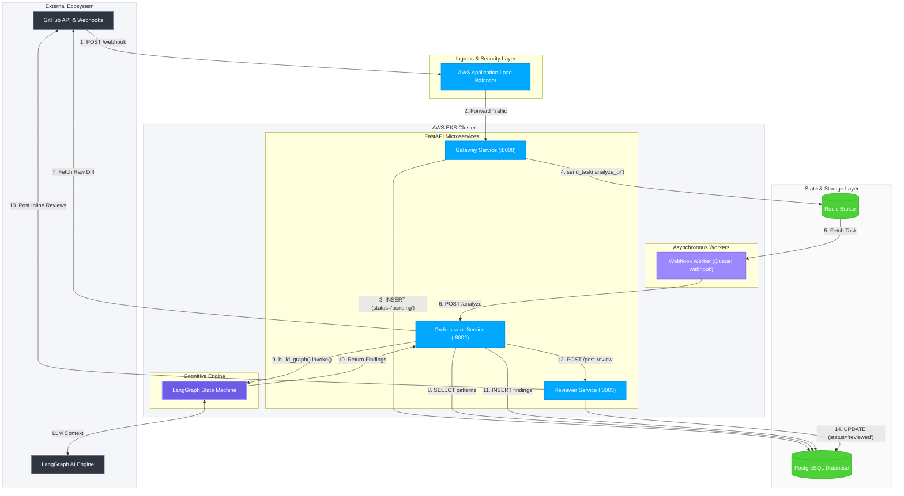

```mermaid
graph TB
    %% --- EXTERNAL ENTITIES ---
    subgraph EXT [External Ecosystem]
        direction LR
        GH["GitHub API & Webhooks"]:::external
        LLM["LangGraph AI Engine"]:::external
    end

    %% --- INGRESS LAYER ---
    subgraph INGRESS [Ingress & Security Layer]
        ALB["AWS Application Load Balancer"]:::gateway
    end

    %% --- COMPUTE LAYER (AWS EKS) ---
    subgraph EKS [AWS EKS Cluster]
        
        subgraph MS [FastAPI Microservices]
            GW["Gateway Service (:8000)"]:::gateway
            ORCH["Orchestrator Service (:8002)"]:::gateway
            REV["Reviewer Service (:8003)"]:::gateway
        end

        subgraph CELERY [Asynchronous Workers]
            WW["Webhook Worker (Queue: webhook)"]:::worker
        end

        subgraph GRAPH [Cognitive Engine]
            LG["LangGraph State Machine"]:::cognitive
        end
    end

    %% --- STATE & STORAGE LAYER ---
    subgraph DATA_LAYER [State & Storage Layer]
        REDIS[("Redis Broker")]:::storage
        DB[("PostgreSQL Database")]:::storage
    end

    %% --- CORE REQUEST LIFECYCLE FLOW ---
    GH -->|"1. POST /webhook"| ALB
    ALB -->|"2. Forward Traffic"| GW
    GW -->|"3. INSERT (status='pending')"| DB
    GW -->|"4. send_task('analyze_pr')"| REDIS
    REDIS -->|"5. Fetch Task"| WW
    WW -->|"6. POST /analyze"| ORCH
    ORCH -->|"7. Fetch Raw Diff"| GH
    ORCH -->|"8. SELECT patterns"| DB
    ORCH -->|"9. build_graph().invoke()"| LG
    LG <-->|"LLM Context"| LLM
    LG -->|"10. Return Findings"| ORCH
    ORCH -->|"11. INSERT findings"| DB
    ORCH -->|"12. POST /post-review"| REV
    REV -->|"13. Post Inline Reviews"| GH
    REV -->|"14. UPDATE (status='reviewed')"| DB

    %% --- STYLES ---
    classDef external fill:#2f3640,stroke:#718093,stroke-width:2px,color:#fff;
    classDef gateway fill:#00a8ff,stroke:#0097e6,stroke-width:2px,color:#fff;
    classDef worker fill:#9c88ff,stroke:#8c7ae6,stroke-width:2px,color:#fff;
    classDef storage fill:#4cd137,stroke:#44bd32,stroke-width:2px,color:#fff;
    classDef cognitive fill:#6c5ce7,stroke:#a29bfe,stroke-width:2px,color:#fff;
    
    style EKS fill:#f5f6fa,stroke:#dcdde1,stroke-width:2px;
    style EXT fill:#f5f6fa,stroke:#dcdde1,stroke-width:2px;
    style DATA_LAYER fill:#fafafa,stroke:#dcdde1,stroke-width:2px;
```
